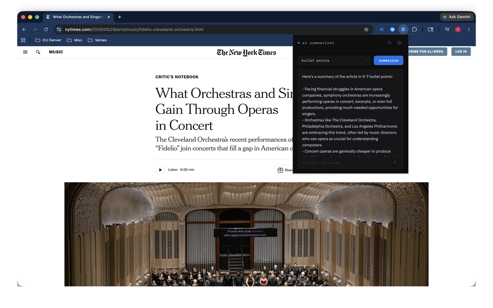
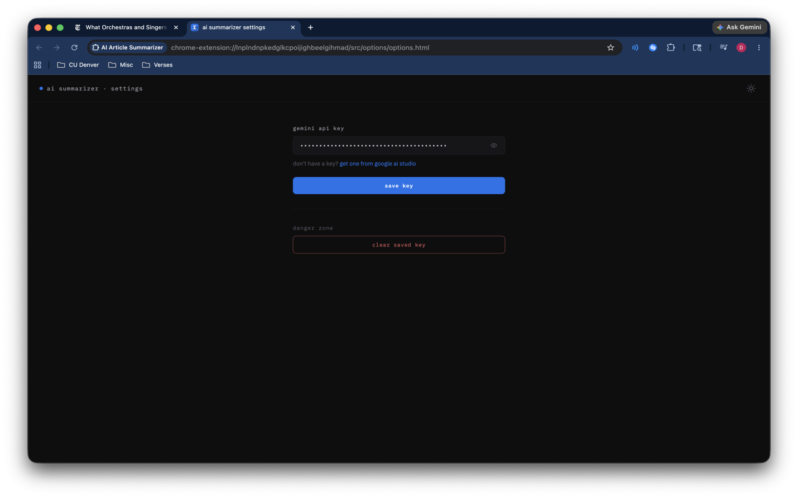

# ai article summarizer

a minimal chrome extension that summarizes any article or webpage using the google gemini api. choose between brief, detailed, or bullet point summaries — all powered by your own api key.



---

## features

- three summary modes — brief, detailed, and bullet points
- clean minimal ui with light and dark mode that syncs across pages
- copy summary to clipboard with one click
- secure api key storage using chrome's built-in sync storage
- works on any webpage

---

## screenshots

<p align="center">
  
  &nbsp;&nbsp;
  
</p>

---

## built with

- react + vite
- crxjs vite plugin
- lucide react icons
- google gemini api (gemini-2.5-flash)
- ibm plex mono + ibm plex sans

---

## getting started

### prerequisites
- node.js
- a google gemini api key — get one free at [ai.google.dev](https://ai.google.dev)

### local development

```bash
# clone the repo
git clone https://github.com/yourusername/ai-article-summarizer.git
cd ai-article-summarizer

# install dependencies
npm install

# start dev server
npm run dev
```

then load the `dist/` folder as an unpacked extension in chrome:
1. go to `chrome://extensions`
2. enable **developer mode**
3. click **load unpacked** and select the `dist/` folder

### production build

```bash
npm run build
```

---

## usage

1. install the extension from the [chrome web store](#)
2. click the extension icon and open settings with the gear icon
3. paste your gemini api key and save
4. navigate to any article and click summarize

---

## privacy

this extension does not collect or store any personal data. your api key is stored locally using chrome's built-in sync storage and is only used to make requests to the gemini api on your behalf.

read the full [privacy policy](https://yourusername.github.io/ai-article-summarizer-privacy).

---

## license

mit

---

icon made by [flaticon.com](https://www.flaticon.com)
